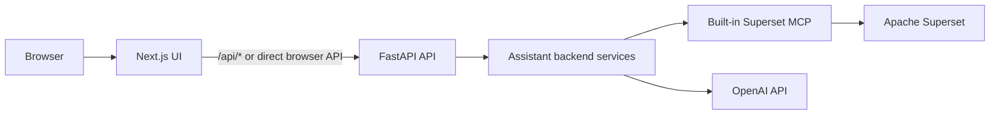

# Architecture

This document captures the current high-level architecture of the released
Superset AI Assistant.

## System Summary

The product is a single-stack analytics assistant that combines:

- `Next.js` for the user-facing UI;
- `FastAPI` for auth, chat, viz, scan, and frontend-log APIs;
- `Apache Superset` for datasets, charts, dashboards, and SQL Lab;
- the built-in `Superset MCP service` as the product tool layer.

Supported runtime path:

`Browser -> Next.js -> FastAPI -> backend services -> built-in MCP -> Superset`

Not part of the active product path:

- legacy Streamlit runtime;
- external `superset-mcp/main.py`;
- websocket assistant transport.

## High-Level Diagram

## Main Product Windows

| Window | Route | Role |
| --- | --- | --- |
| Login | `/login` | Sign in |
| Register | `/register` | Create assistant account |
| Chat | `/app/chat` | Primary NL-to-analytics flow |
| Preview | `/app/preview` | Inspect rows and field profiles |
| Recommend | `/app/recommend` | Suggest chart type |
| Share | `/app/share` | Create chart and dashboard |
| Scan | `/app/scan` | Discover databases, tables, and relations |

## Main User Flows

### 1. Chat-first flow

Used when the user already knows the question.

Flow:

1. sign in;
2. open `/app/chat`;
3. ask a business or technical question;
4. assistant resolves likely datasets and tools;
5. reply may include table/chart/link artifacts;
6. user follows chart/dashboard links into Superset if needed.

### 2. Preview-driven chart flow

Used when the user wants to validate data before building.

Flow:

1. open `/app/preview`;
2. select database and dataset;
3. run preview SQL;
4. inspect row sample and column profiles;
5. move to `/app/recommend`;
6. move to `/app/share`;
7. create chart and dashboard.

### 3. Source-discovery flow

Used when the data source is not yet known.

Flow:

1. open `/app/scan`;
2. run schema scan;
3. inspect PostgreSQL candidates and profiled tables;
4. move into preview or chat with a clearer source hypothesis.

### 4. Pagila demo flow

Used for demo and release validation.

Flow:

1. confirm `Pagila Demo (PostgreSQL)` through scan or dataset discovery;
2. ask for a chart or dashboard in chat, or run preview/recommend/share;
3. create Superset chart/dashboard objects;
4. reuse saved chart/dashboard artifacts in follow-up prompts.

## Frontend Architecture Summary

### Shell and navigation

The protected app shell:

- redirects anonymous users to `/login`;
- renders the shared sidebar;
- handles responsive mobile/desktop navigation;
- keeps chat helper toggle state in shared shell state.

### State model

There are three major frontend state domains:

1. `auth`
2. `chat UI + chat data`
3. `viz flow context`

Chat state and viz state are intentionally separate:

- chat state is persisted server-side through FastAPI/AuthService;
- viz flow context is persisted client-side for preview/recommend/share.

### API access

The frontend can call FastAPI through:

- a Next.js catch-all API proxy route;
- an optional direct browser URL defined by `NEXT_PUBLIC_BROWSER_API_URL`.

This split exists to reduce risk from long-lived chat requests routed through
the Next.js proxy.

## Backend Architecture Summary

### API contract layer

FastAPI exposes thin, typed routers around backend services. It handles:

- request validation;
- auth and cookie handling;
- dependency wiring;
- runtime config validation;
- response DTOs;
- release metadata exposure in health checks.

### Service layer

The backend service layer contains:

- auth and chat persistence;
- agent orchestration;
- viz operations;
- schema scan;
- observability and structured logs;
- MCP runtime/client integration.

### Assistant orchestration

The assistant agent:

- applies guardrails;
- builds dataset search context;
- handles Pagila-aware chart/dashboard flows;
- shapes responses for business vs technical mode;
- attaches reusable artifacts to responses.

### Viz service

The viz service is the main synchronous wrapper used by:

- preview route;
- recommend route;
- share route;
- assistant-side chart/dashboard generation.

It owns:

- metadata lookup;
- preview execution;
- chart recommendation;
- chart param building;
- link normalization;
- dashboard/widget creation helpers.

## Data And Persistence Model

### Assistant auth DB

`auth.db` stores:

- users;
- active assistant session id;
- chat sessions;
- chat messages;
- per-chat settings;
- message metadata/artifacts.

### Chat model

Chat session records are the source of truth for:

- session titles;
- active pointer;
- archived/deleted state;
- response-style settings.

Message records are the source of truth for:

- visible history;
- response metadata;
- reusable artifacts.

### Viz-flow client state

Preview and recommendation context are stored client-side in session storage so
the user can move from:

`preview -> recommend -> share`

without rebuilding the same context manually on each page.

## Built-in MCP Architecture

### Product-side client runtime

The assistant-side MCP layer provides:

- runtime selection between stdio and HTTP;
- a built-in product client;
- a legacy contract adapter;
- tool-inventory enforcement for required product tools.

### Superset-side MCP

The Superset repo contains:

- core MCP service code;
- chart/system utilities;
- product extension tools for migration parity.

This is the new source of truth for tool execution in the released product.

## Deployment And Runbook Summary

### Supported publication model

- `assistant.example.com` serves Next.js and proxies `/api/*` to FastAPI;
- Superset stays on its own public host;
- FastAPI should not be published directly as a raw public port in the preferred
  deployment model.

### Core services in unified dev/prod-like stack

- `assistant-web`
- `assistant-api`
- `superset`
- `mcp-http`
- `db`
- `redis`
- `superset-init`
- optional `pagila-db`

### Main operational docs

- [deployment.md](deployment.md)
- [production-rollout-runbook.md](production-rollout-runbook.md)
- [update-and-debug.md](update-and-debug.md)
- [manual-smoke-checklist.md](manual-smoke-checklist.md)

## What This Version Implements

The current release includes:

- final runtime migration away from legacy external MCP;
- Next.js as the only supported user UI;
- FastAPI as the primary API;
- chat session CRUD and per-chat settings;
- improved assistant response shaping;
- inline chat artifacts and cleaned link rendering;
- preview, recommend, share, and scan pages wired into the same product;
- Pagila-aware chart and dashboard flows;
- responsive mobile and desktop shell improvements;
- CI coverage for assistant tests, MCP inventory, and Superset MCP units.

## Non-Goals Of This Version

Explicit non-goals or not-yet-exposed features:

- separate UI for managing glossary/mapping helper modules;
- existing-dashboard selection in the share page;
- fully automated browser E2E coverage for every UI scenario;
- broad refactors outside the MCP migration and release-hardening scope;
- restoration of the retired Streamlit runtime.

## Known Architectural Caveats

- some verification remains smoke-based at the UI level;
- auth UI text is partially English while the main product surface is mostly
  Russian;
- scan is synchronous in the current UI;
- frontend typecheck debt is not treated as the primary release gate;
- local unrelated dirty files can exist in `auth.db` and guardrails files and
  should not be pulled into release scope unintentionally.
