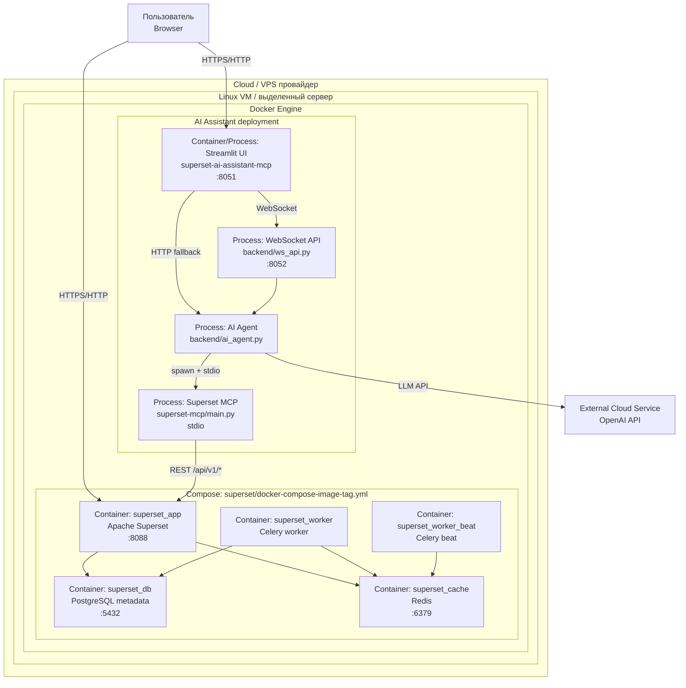

# Схема Развёртывания

Документ описывает схему Deployment для проекта `superset_ai` в формате: **облако → сервер → контейнеры**.

## 1) Диаграмма развёртывания (Deployment: облако/сервер/контейнеры)

## 2) Где разворачиваются компоненты

| Уровень | Компоненты | Где размещены |
|---|---|---|
| Облако / датацентр | VM / сервер | IaaS/VPS или физический сервер |
| Сервер (OS) | Docker Engine | Linux host |
| Контейнеры Superset | `superset_app`, `superset_db`, `superset_cache`, `superset_worker`, `superset_worker_beat` | Один docker network (`docker-compose-image-tag.yml`) |
| Контейнер/процесс AI | Streamlit UI + backend сервисы + MCP subprocess | Отдельный контейнер `ai_superset` или локальный процесс |
| Внешние сервисы | OpenAI API | Внешнее облако (SaaS API) |

## 3) Компоненты и их назначение

| Компонент | Расположение | Назначение |
|---|---|---|
| Streamlit UI | `superset-ai-assistant-mcp/frontend/app.py` | Пользовательский интерфейс ассистента |
| WebSocket API | `superset-ai-assistant-mcp/backend/ws_api.py` | Real-time канал событий `status/chunk/done` для чата |
| AI Agent | `superset-ai-assistant-mcp/backend/ai_agent.py` | Оркестрация запроса, guardrails, работа с LLM и MCP |
| MCP Server | `superset-mcp/main.py` | Программный доступ к Superset API через MCP-инструменты |
| Superset App | `superset_app` | BI-платформа, SQL Lab, charts/dashboards |
| Superset DB | `superset_db` | Метаданные Superset (PostgreSQL) |
| Superset Cache | `superset_cache` | Redis для кэша/очередей |
| Worker/Beat | `superset_worker`, `superset_worker_beat` | Фоновые задачи Superset |
| OpenAI API | внешний сервис | LLM для NL→SQL и генерации/уточнений |

## 4) Сетевые точки и порты

| Endpoint | Порт | Использование |
|---|---|---|
| `http://<host>:8051` | 8051 | UI ассистента (Streamlit) |
| `ws://<host>:8052/ws/chat/<session_id>` | 8052 | WebSocket transport для stream-ответов чата |
| `http://<host>:8088` | 8088 | Apache Superset |
| `superset_db` | 5432 | Внутренняя БД Superset |
| `superset_cache` | 6379 | Внутренний Redis |

Примечание: MCP-сервер в текущем проекте обычно запускается как subprocess и общается с агентом через `stdio` (без публичного HTTP порта).

## 5) Потоки данных

1. Пользователь отправляет запрос в `Streamlit`.
2. `Streamlit` открывает WebSocket к `backend/ws_api.py` и передаёт payload чата.
3. `WS API` вызывает `AI Agent`, который применяет guardrails и готовит контекст.
4. Агент вызывает `OpenAI API` для генерации/интерпретации.
5. Для операций Superset агент вызывает MCP-инструменты (`superset-mcp/main.py`).
6. MCP ходит в `Superset REST API` (`/api/v1/...`).
7. `WS API` отдаёт в поток события `status/chunk/done`, Streamlit рендерит ответ и trace.

## 6) Переменные окружения, критичные для развёртывания

Основные переменные (см. `superset-ai-assistant-mcp/.env.example` или `supersetai-assistant-mcp/.env`):

- `OPENAI_API_KEY`
- `OPENAI_MODEL`
- `SUPERSET_BASE_URL`
- `SUPERSET_PUBLIC_URL`
- `SUPERSET_USERNAME`
- `SUPERSET_PASSWORD`
- `SUPERSET_MCP_PATH`
- `SUPERSET_MCP_PYTHON`
- `US15_SHARE_BASE_URL`
- `AI_ASSISTANT_WS_BASE_URL`

## 7) Минимальный сценарий запуска (для этой схемы)

1. Поднять Superset стек:
   - `cd superset`
   - `docker compose -f docker-compose-image-tag.yml up -d`
2. Поднять ассистент:
   - локально: `uvicorn backend.ws_api:app --app-dir . --host 0.0.0.0 --port 8052` + `streamlit run frontend/app.py --server.port 8051 --server.address 0.0.0.0`
   или
   - контейнером `ai_superset` на портах `8051` и `8052`
3. Проверить доступность:
   - `http://<host>:8088` (Superset)
   - `http://<host>:8051` (Assistant)
   - `http://<host>:8052/health` (WS API health)

## 8) Ограничения текущего deployment

- Конфигурация ориентирована на MVP/демо и учебный контур.
- Для production требуются отдельные меры: TLS, секреты, hardening, отказоустойчивость, мониторинг/алертинг, backup-политики.

## 9) Как показать WebSocket на практике

1. Поднять `WS API` и `Streamlit`, открыть `http://<host>:8051`.
2. В sidebar выбрать транспорт `WebSocket (stream)` и проверить `WS base URL`.
3. Отправить длинный запрос в чате (чтобы ответ приходил частями).
4. Показать блок `WebSocket trace (last request)`:
   - события `status` (этапы обработки),
   - события `chunk` (поток текста),
   - событие `done` (`latency_ms`, `finish_reason`).
5. Для сравнения переключить транспорт на `HTTP (legacy)` и показать, что trace не заполняется и ответ приходит одним блоком.
