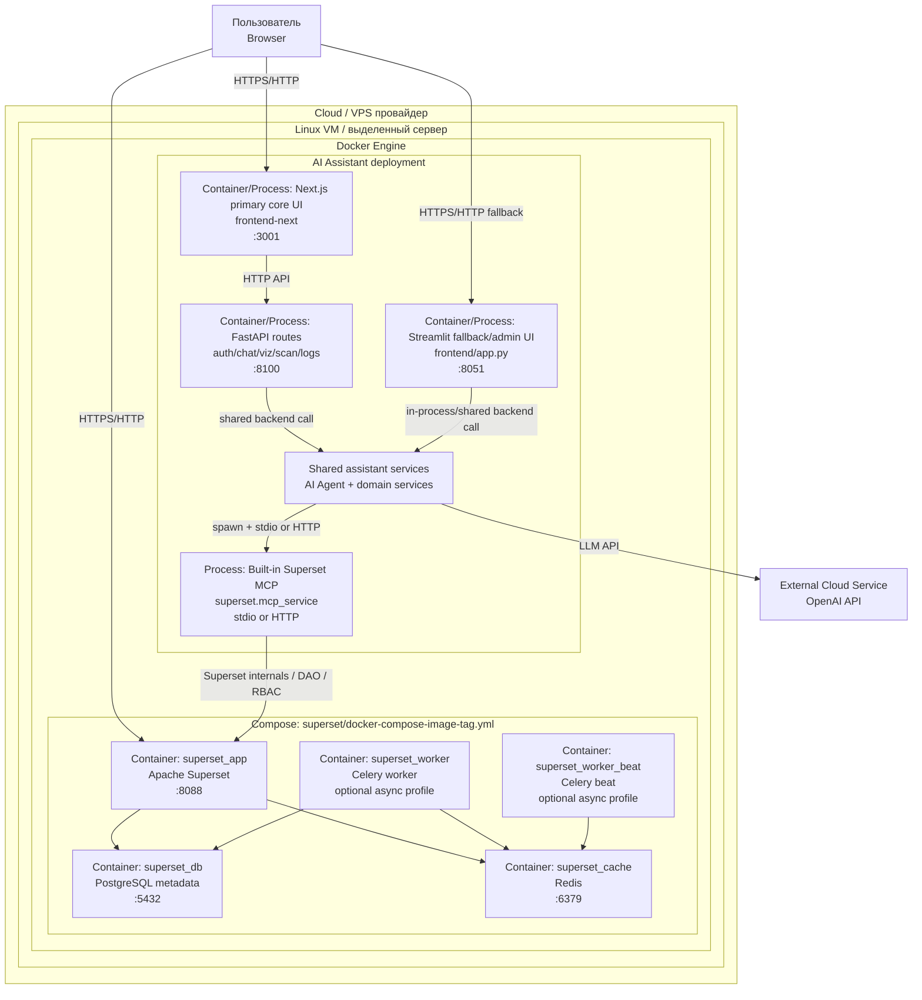

# Схема Развёртывания

Документ описывает актуальную схему deployment для проекта `superset_ai` в формате:
**облако → сервер → контейнеры**.

Phased cutover scope и rollback-логика зафиксированы отдельно в
`docs/phased-cutover-plan.md`.

Текущее состояние после упрощения транспорта:

- primary core UI path проходит через `Next.js -> FastAPI -> shared assistant services`
- Streamlit остаётся fallback/helper-admin UI path для `US2-US5`
- отдельный streaming backend больше не используется
- поддерживаемый Docker-сценарий остаётся split-моделью: Superset через compose, ассистент отдельным процессом/контейнером
- дополнительно доступен optional unified local dev stack через `docker-compose.dev.yml`
- unified local dev stack по-прежнему поднимает Streamlit fallback console; Next.js primary path запускается отдельно
- Celery worker/beat оставлены только как опциональный профиль для фоновых задач Superset, а не как обязательная часть базового запуска проекта

## 1) Диаграмма развёртывания



## 2) Где разворачиваются компоненты

| Уровень | Компоненты | Где размещены |
|---|---|---|
| Облако / датацентр | VM / сервер | IaaS/VPS или физический сервер |
| Сервер (OS) | Docker Engine | Linux host |
| Контейнеры Superset | `superset_app`, `superset_db`, `superset_cache` | Базовый проектный стек в `docker-compose-image-tag.yml` |
| Опциональные контейнеры Superset | `superset_worker`, `superset_worker_beat` | Профиль `async` для фоновых задач Superset |
| Контейнер/процесс AI | Next.js primary UI, FastAPI routes, Streamlit fallback UI и shared assistant services | Отдельные процессы/контейнеры ассистентского слоя |
| Внешние сервисы | OpenAI API | Внешнее облако (SaaS API) |

## 3) Компоненты и их назначение

| Компонент | Расположение | Назначение |
|---|---|---|
| Next.js UI | `superset-ai-assistant-mcp/frontend-next/` | Primary core UI path для auth, chat, preview, recommend, share, scan |
| FastAPI | `superset-ai-assistant-mcp/api/` | Auth/chat/viz/scan/logging API для primary core path |
| Streamlit UI | `superset-ai-assistant-mcp/frontend/app.py` + shared frontend helpers | Fallback/helper-admin UI path для `US2-US5` и rollback |
| AI Agent / domain services | `superset-ai-assistant-mcp/backend/` | Оркестрация запроса, guardrails, работа с LLM и built-in MCP в shared backend-модулях |
| MCP Server | `superset/superset/mcp_service` | Built-in MCP runtime для работы с Superset tools / DAO / RBAC |
| Superset App | `superset_app` | BI-платформа, SQL Lab, charts/dashboards |
| Superset DB | `superset_db` | Метаданные Superset (PostgreSQL) |
| Superset Cache | `superset_cache` | Redis для кэша/очередей |
| Worker/Beat | `superset_worker`, `superset_worker_beat` | Фоновые задачи Superset |
| OpenAI API | внешний сервис | LLM для NL→SQL и генерации/уточнений |

## 4) Сетевые точки и порты

| Endpoint | Порт | Использование |
|---|---|---|
| `http://<host>:3001` | 3001 | Primary core UI (Next.js) |
| `http://<host>:8100` | 8100 | FastAPI auth/chat/viz/scan/logging API |
| `http://<host>:8051` | 8051 | Streamlit fallback/admin UI |
| `http://<host>:8088` | 8088 | Apache Superset |
| `superset_db` | 5432 | Внутренняя БД Superset |
| `superset_cache` | 6379 | Внутренний Redis |

Примечание: built-in MCP в текущем проекте обычно запускается как subprocess через `stdio`, но также поддерживается режим `built_in_http`. Отдельный assistant Docker image не включает код `superset.mcp_service`, поэтому для контейнерного запуска нужен либо `built_in_http`, либо явный stdio launcher.

## 5) Потоки данных

1. Пользователь для core flows открывает `Next.js`.
2. `Next.js` вызывает `FastAPI`.
3. `FastAPI` использует shared backend-модули и при необходимости `AI Agent`.
4. Для helper/admin fallback пользователь при необходимости открывает `Streamlit`.
5. И `FastAPI`, и `Streamlit` используют одни и те же backend service modules.
6. Shared backend вызывает `OpenAI API` и built-in MCP.
7. Built-in MCP использует внутренние Superset tools / DAO / RBAC вместо legacy REST-прокси.

## 6) Переменные окружения, критичные для развёртывания

Основные переменные:

- `OPENAI_API_KEY`
- `OPENAI_MODEL`
- `SUPERSET_PRODUCT_MCP_RUNTIME`
- `SUPERSET_BUILT_IN_MCP_COMMAND`
- `SUPERSET_BUILT_IN_MCP_ARGS`
- `SUPERSET_BUILT_IN_MCP_URL`
- `SUPERSET_BASE_URL`
- `SUPERSET_PUBLIC_URL`
- `US15_SHARE_BASE_URL`
- `AUTH_DB_PATH`
- `AUTH_JWT_SECRET`

## 7) Минимальный сценарий запуска

1. Поднять Superset стек:
   - `cd superset`
   - `docker compose -f docker-compose-image-tag.yml up -d db redis superset-init superset`
   - `docker compose -f docker-compose-image-tag.yml config --services`
   - если нужны Celery background jobs: `docker compose -f docker-compose-image-tag.yml --profile async up -d superset-worker superset-worker-beat`
2. Поднять primary backend:
   - локально: `.venv/bin/python -m uvicorn api.main:app --host 0.0.0.0 --port 8100`
3. Поднять primary frontend:
   - локально: `NEXT_PUBLIC_API_URL=http://127.0.0.1:8100 npm run dev -- --hostname 0.0.0.0 --port 3001`
4. При необходимости поднять Streamlit fallback:
   - локально: `streamlit run frontend/app.py --server.port 8051 --server.address 0.0.0.0`
   - или контейнером `ai_superset` на порту `8051` из `superset-ai-assistant-mcp/Dockerfile`
5. Проверить доступность:
   - `http://<host>:8088` (Superset)
   - `http://<host>:3001` (primary Next.js UI)
   - `http://<host>:8100/api/health` (FastAPI)
   - `http://<host>:8051` (Streamlit fallback)

## 8) Опциональный unified local dev stack

Этот вариант предназначен для локальной разработки/демо одной командой и не заменяет split-модель как базовый deployment.
В phased cutover он даёт Superset + MCP + Streamlit fallback console; primary Next.js/FastAPI стартует отдельно.

Состав:
- `db`
- `redis`
- `superset-init`
- `superset`
- `mcp-http`
- `assistant`
- optional profile `async`: `superset-worker`, `superset-worker-beat`

Ключевое решение:
- MCP для ассистента подключается по `built_in_http`
- `assistant` использует `SUPERSET_BUILT_IN_MCP_URL=http://mcp-http:5008/mcp/`
- контейнер `mcp-http` запускает built-in MCP из локального дерева `superset/`, а не из assistant image

Запуск:
```bash
cd /home/superset_ai
cp .env.dev.example .env.dev
docker compose --env-file .env.dev -f docker-compose.dev.yml up -d
```

Проверка:
```bash
docker compose --env-file .env.dev -f docker-compose.dev.yml ps
curl -I http://127.0.0.1:8088
curl -I http://127.0.0.1:8051
```

Примечания:
- по умолчанию используется `SUPERSET_LOAD_EXAMPLES=no`, чтобы первый запуск не зависал на загрузке sample datasets
- если локально уже занят `8088` или `8051`, задайте `DEV_SUPERSET_PORT` и `DEV_ASSISTANT_PORT` в `.env.dev`
- verified path: compose config, container startup, HTTP-ответы Superset и assistant, и подключение assistant runtime к built-in MCP endpoint внутри compose-сети

## 9) Ограничения текущего deployment

- Конфигурация ориентирована на MVP/демо и учебный контур.
- Для production требуются отдельные меры: TLS, секреты, hardening, отказоустойчивость, мониторинг/алертинг, backup-политики.

## 10) Как показать текущий HTTP-only assistant path на практике

1. Поднять `FastAPI` и `Next.js`, открыть `http://<host>:3001/login`.
2. Пройти авторизацию и пройти core path: chat -> preview -> recommend -> share -> scan.
3. Показать trace correlation в `frontend.log`, `agent.log`, `mcp.log`, `artifact.log`.
4. При необходимости открыть `http://<host>:8051` и показать, что Streamlit остаётся fallback path для `US2-US5`.
