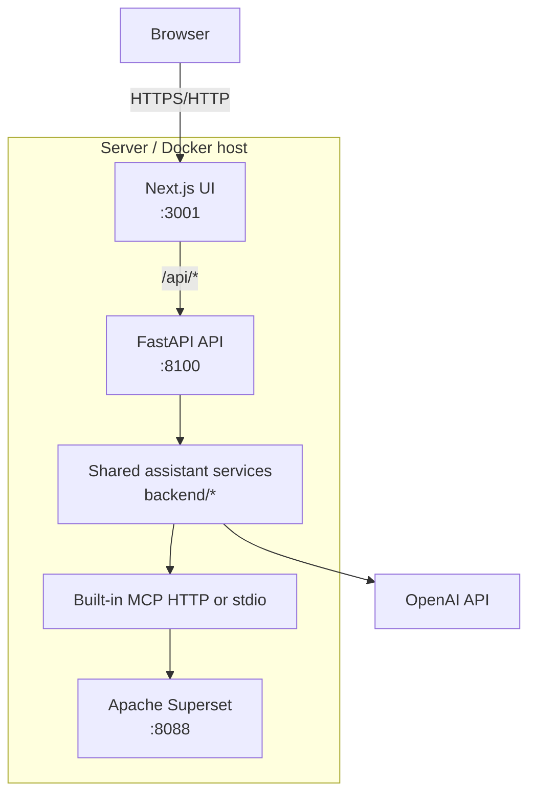

# Deployment

Текущая схема deployment после retirement Streamlit runtime:

- user-facing UI: `Next.js`
- primary API: `FastAPI`
- BI platform: `Superset`
- Superset access from assistant: built-in MCP service

`Streamlit` больше не является поддерживаемым runtime path.

## Current Architecture



## Components

| Component | Path | Role |
|---|---|---|
| Next.js UI | `superset-ai-assistant-mcp/frontend-next/` | Primary user interface |
| FastAPI | `superset-ai-assistant-mcp/api/` | Auth, chats, viz, scan, frontend logs |
| Shared backend | `superset-ai-assistant-mcp/backend/` | Agent and domain services |
| Built-in MCP | `superset/superset/mcp_service/` | Superset tools / DAO / RBAC access |
| Superset | `superset/` compose stack | SQL Lab, charts, dashboards |

Retained but not exposed as UI runtime:
- `backend/us2_glossary_service.py`
- `backend/us3_mapping_rules.py`
- `backend/us4_query_assistant.py`
- `backend/us5_query_builder.py`

## Public Access Model

Recommended production-like publication:

- `https://assistant.example.com/` -> `Next.js`
- `https://assistant.example.com/api/*` -> `FastAPI`
- `https://superset.example.com/` -> `Superset`

Reverse proxy example:
- `docs/examples/nginx-primary-ui.conf.example`

## Local Ports

| Endpoint | Port | Purpose |
|---|---|---|
| `http://<host>:3001` | 3001 | Next.js UI |
| `http://<host>:8100` | 8100 | FastAPI API |
| `http://<host>:8088` | 8088 | Superset |
| `mcp-http:5008` | 5008 | Built-in MCP HTTP inside unified compose |

## Bring-Up

### Unified local dev stack

```bash
cd /home/superset_ai
cp .env.dev.example .env.dev
docker compose --env-file .env.dev -f docker-compose.dev.yml up -d --build
```

Stack services:
- `superset`
- `mcp-http`
- `assistant-api`
- `assistant-web`
- supporting `db`, `redis`, `pagila-db`, `superset-init`

### Split run

1. Superset:
```bash
cd /home/superset_ai/superset
docker compose -f docker-compose-image-tag.yml up -d db redis superset-init superset
```
2. FastAPI:
```bash
cd /home/superset_ai/superset-ai-assistant-mcp
.venv/bin/python -m uvicorn api.main:app --host 0.0.0.0 --port 8100
```
3. Next.js:
```bash
cd /home/superset_ai/superset-ai-assistant-mcp/frontend-next
npm install
NEXT_PUBLIC_API_URL=http://127.0.0.1:8100 npm run dev -- --hostname 0.0.0.0 --port 3001
```

## Health Verification

```bash
docker compose --env-file .env.dev -f docker-compose.dev.yml ps
curl http://127.0.0.1:8100/api/health
curl -I http://127.0.0.1:3001/login
curl -I http://127.0.0.1:8088/health
```

External checks after proxy publication:

```bash
curl -I https://assistant.example.com/login
curl -I https://assistant.example.com/api/health
curl -I https://superset.example.com/health
```

## Rollback Model

Rollback now means restoring the previous known-good `Next.js/FastAPI`
deployment, not redirecting users to a Streamlit fallback.

Recommended operator actions:

1. keep the failed deployment logs and trace identifiers
2. restore the previous compose revision, image tag, or application build
3. re-run `docs/manual-smoke-checklist.md`
4. re-open traffic to the restored primary stack

## Related Docs

- `docs/production-rollout-runbook.md`
- `docs/update-and-debug.md`
- `docs/manual-smoke-checklist.md`
- `docs/streamlit-retirement-summary.md`
- `docs/dual-run-parity-readiness.md` (historical archive)
- `docs/phased-cutover-plan.md` (historical archive)
- `docs/phased-cutover-signoff.md` (historical archive)
